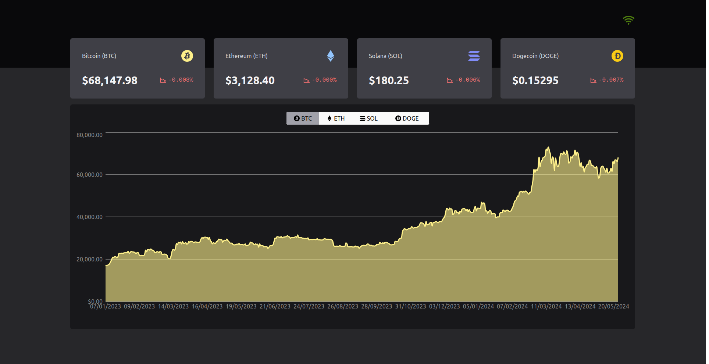

# Cryptocurrency Dashboard



## About
This project is a dashboard that updates the prices of Bitcoin, Ethereum, Solana, and Dogecoin in real-time and calculates the price variation from the first price received from Binance. It also displays a chart showing the price evolution of each cryptocurrency.

A WebSocket is used for real-time price updates, and the Binance API is called to fetch data for the charts. Redux is used for state management in the application.

## How to Run Locally
After cloning the project, navigate to the project directory and install the project dependencies using your package manager.

|||
|---|---|
| pnpm | `pnpm install`|
| yarn | `yarn install`|
| npm | `npm install`|


Create an environment variables file named .env.local and add the following environment variables:
```
VITE_BINANCE_WEB_SOCKET_BASE_URL=wss://stream.binance.com:9443
VITE_BINANCE_API_BASE_URL=https://api.binance.com/api/v3
VITE_RECONNECT_INTERVAL=5000
VITE_MAX_RECONNECT_ATTEMPTS=3
```

With the environment variables set and the packages installed, simply run the following command:
|||
|---|---|
| pnpm | `pnpm dev`|
| yarn | `yarn dev`|
| npm | `npm run dev`|